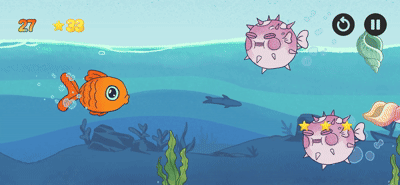
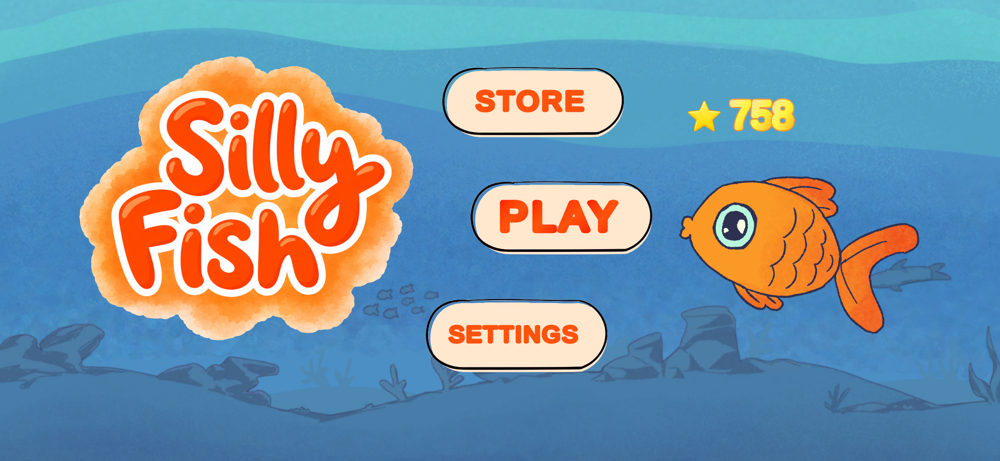
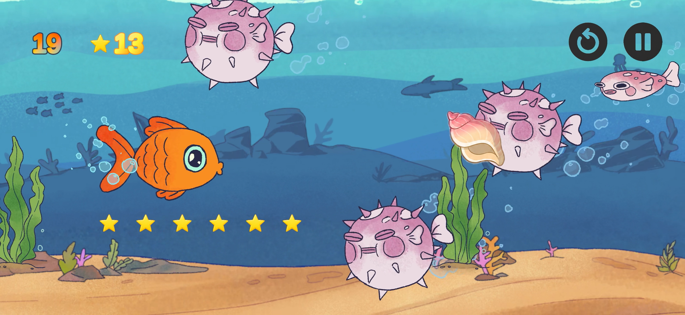
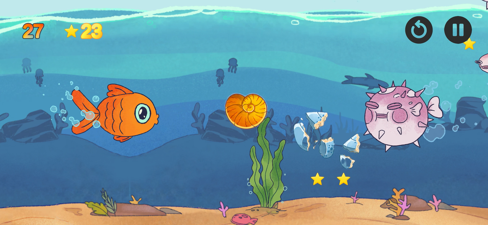
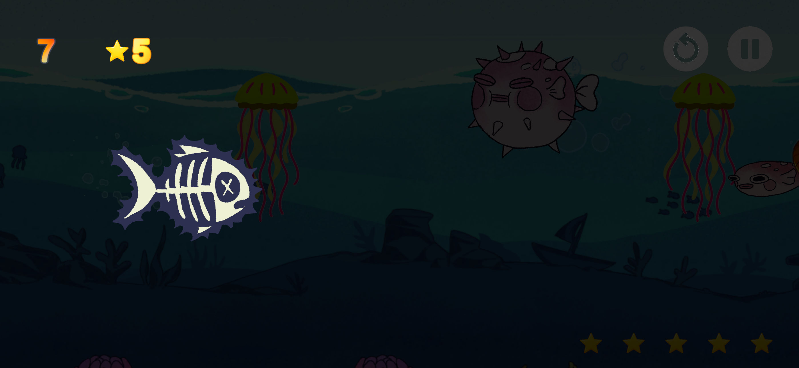
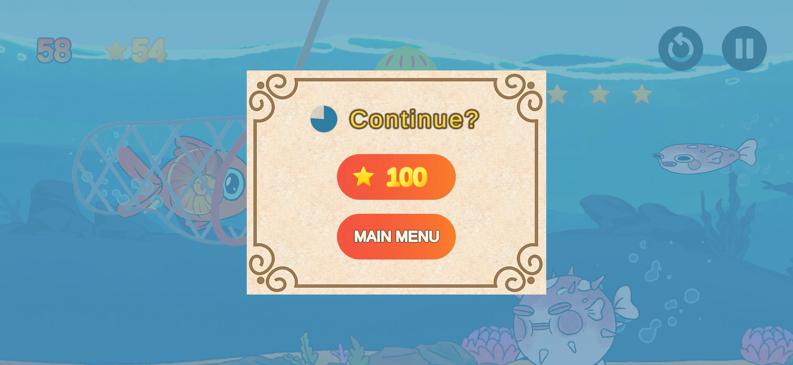

# 🐟 Silly Fish

<p align="center">
  
</p>

**Silly Fish** is a 2D mobile arcade game currently in development with **Unity and C#**.

The game combines touch-based navigation, physics interactions, obstacle avoidance, and swipe mechanics in a colorful underwater environment.

> 🚧 **Development Status:** Work in Progress  
> The complete Unity project and source code are currently kept private while the game is under active development.

---

## 🎮 Gameplay

The player controls a small fish navigating through an increasingly challenging underwater environment.

Instead of directly moving the fish, the player interacts with the world and obstacles using different touch gestures.

### Current gameplay mechanics

- Touch-based world navigation
- Swipe-to-slice seashell obstacles
- Draggable and throwable pufferfish
- Physics-based interactions between obstacles
- Dynamic obstacle spawning
- Progressive difficulty scaling
- Score and persistent high-score system
- Animated game-over sequence
- Mobile touch controls
- Animated player and obstacle sprites
- Parallax underwater environment

---

## 🐡 Pufferfish Mechanics

Pufferfish enter the screen and inflate after a short delay.

Once inflated, they become interactive.

The player can:

- Drag them around the screen
- Throw them using swipe velocity
- Push other inflated pufferfish
- Use them to interact with seashells

The system includes custom drag handling, velocity calculation, momentum, collision response, and movement constraints.

---

## 🐚 Seashell Slicing

Seashells move toward the player and must be sliced before reaching the fish.

The slicing system detects swipe paths using Unity's 2D physics system.

When a seashell is sliced:

- The intact seashell is destroyed
- Broken fragments are generated dynamically
- Fragments inherit part of the shell's original movement
- Gravity affects the fragments
- Random angular velocity creates a breaking effect
- The player receives a score point

Different seashell variants can use their own intact sprites and matching broken pieces.

---

## 👆 Touch Input System

Several mechanics can react to the same touch input, so the game includes input-priority logic.

The player can:

- Drag the world vertically
- Slice seashells
- Drag inflated pufferfish

These systems communicate with each other to prevent one gesture from accidentally activating multiple mechanics.

For example, touching an inflated pufferfish prioritizes dragging the pufferfish instead of moving the world.

---

## 📈 Dynamic Difficulty

The game becomes progressively harder over time.

A global difficulty system controls different gameplay elements such as:

- Obstacle spawn frequency
- Background movement speed
- Number of obstacles
- Overall game pace

This allows multiple gameplay systems to scale together as the session continues.

---

## 🏆 Score & High Score

The game includes:

- Runtime score tracking
- Persistent local high-score storage
- New high-score detection
- Visual feedback when a new record is reached

High scores are stored locally using Unity's `PlayerPrefs`.

---

## 💥 Game Over

When the fish collides with a dangerous obstacle, a custom game-over sequence begins.

The sequence includes:

1. Collision detection
2. Slow-motion transition
3. Fishing net catch animation
4. Game pause
5. Game-over interface

The fishing net animation uses unscaled time so that it can continue while the rest of the game is slowing down.

---

## 🌊 Parallax Environment

The underwater environment is composed of multiple visual layers moving at different relative speeds.

This creates a sense of depth while preserving consistent speed ratios as the game's difficulty increases.

The environment includes layers such as:

- Sky
- Sea
- Middleground
- Waves
- Coral
- Sand

---

## 📸 Screenshots

### Gameplay

<p align="center">
  
</p>

### Pufferfish Interaction

<p align="center">
  
</p>

### Seashell Slicing

<p align="center">
  
</p>

### Jellyfish Shock Effect

<p align="center">
  
</p>

### Game Over

<p align="center">
  
</p>

---

## 🎥 Gameplay Demo

A gameplay video is available here:

**[Watch Gameplay Demo](https://youtu.be/5HkdZnG7HCc?si=Q3vpCImaVFR5pfUM)**

---

## 🛠️ Built With

### Engine

- Unity

### Programming

- C#

### Unity Systems

- Unity 2D
- Rigidbody2D
- Collider2D
- SpriteRenderer
- Coroutines
- Unity UI
- Touch and Mouse Input
- PlayerPrefs

### Target Platform

- Mobile
- Currently tested primarily on iOS

---

## 🧠 Technical Highlights

During the development of Silly Fish, I worked on:

- Coordinating multiple touch-based interaction systems
- Custom drag and throw mechanics
- Physics interactions between different obstacle types
- Dynamic obstacle spawning
- Progressive difficulty scaling
- Runtime creation of physics-based sprite fragments
- Persistent high-score storage
- Game state management
- Coroutine-based animations
- Mobile input handling
- Parallax environment movement
- Supporting both mouse input for Unity Editor testing and touch input for mobile devices

---

## 🏗️ Project Architecture

The complete implementation is kept private, but the main gameplay systems are organized approximately as follows:

```text
GameManager
│
├── Score System
├── High Score System
├── Difficulty System
└── Game Over System

Input Systems
│
├── World Drag
├── Seashell Slice
└── Pufferfish Drag

Obstacle Systems
│
├── Pufferfish
│   ├── Animation
│   ├── Drag & Throw
│   └── Collision Interaction
│
└── Seashell
    ├── Spawning
    ├── Player Targeting
    ├── Slicing
    └── Fragment Physics

Environment
│
├── Parallax Layers
└── Background Movement
```

---

## 🚧 Current Development

Silly Fish is still under active development.

Current work focuses on:

- Gameplay balancing
- Additional obstacles
- Animation refinement
- Visual polish
- Mobile testing
- UI improvements
- Difficulty balancing

---

## 🔒 Source Code

The main development repository is private.

This repository is intended as a **public project showcase** containing gameplay footage, screenshots, technical information, and development highlights.

The complete source code, Unity scenes, prefabs, and original project assets are not included in this repository.

Source access may be provided privately for technical review when appropriate.

---

## 👩‍💻 Developer

**İremnur Yıldız**  
Computer Engineering Student  
Boğaziçi University

[GitHub](github.com/iremnury) · [LinkedIn](www.linkedin.com/in/iremnur-yildiz)

---

© 2026 İremnur Yıldız. All rights reserved.
